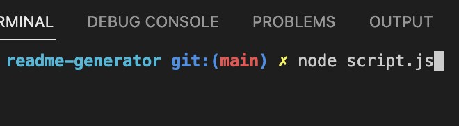
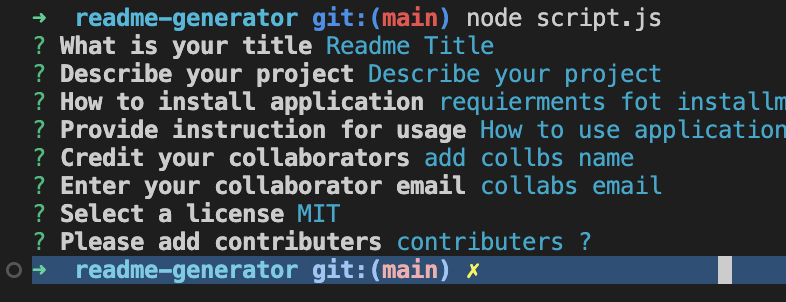
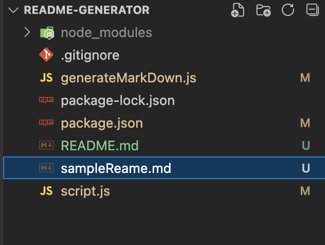

# Your Project Title

## Description 

This command-line application will help developers quickly create a professional and high-quality README for any new project. When prompted for information about the application repository, including title, description, installation instructions, usage information, contribution guidelines, test instructions, license, GitHub username, and email address, this application will generate an impressive README.md file. 

## Table of Contents 

If your README is very long, add a table of contents to make it easy for users to find what they need.

* [Installation](#installation)
* [Usage](#usage)
* [Credits](#credits)
* [License](#license)

## Installation

1. Download and install the Node.js package from the official website: https://nodejs.org/en/
2. Follow the instructions on the website to install the package. 
3. Once installed, open the terminal of your operating system to confirm that Node.js has been successfully installed by typing 'node -v' and press enter. This should return the version number of Node.js installed. 
4. Congratulations! You have successfully set up Node.js.         cle

## Usage 

### Use the next steps for applicatiosn usage

* - Step One Use command line.

*  - Step two answer questionary

* - Step three after completing quetionary all Readme has been generated

## Credits

List your collaborators, if any, with links to their GitHub profiles.

If you used any third-party assets that require attribution, list the creators with links to their primary web presence in this section.

If you followed tutorials, include links to those here as well.

## License

No liscense for this project

The last section of a good README is a license. This lets other developers know what they can and cannot do with your project. If you need help choosing a license, use [https://choosealicense.com/](https://choosealicense.com/)

---

🏆 The sections listed above are the minimum for a good README, but your project will ultimately determine the content of this document. You might also want to consider adding the following sections.

## Badges

No badges used for this project

Badges aren't _necessary_, per se, but they demonstrate street cred. Badges let other developers know that you know what you're doing. Check out the badges hosted by [shields.io](https://shields.io/). You may not understand what they all represent now, but you will in time.

## Credits
 - [Daniel Iam](https://github.com/dann-lam)

## License

The last section of a good README is a license. This lets other developers know what they can and cannot do with your project. If you need help choosing a license, use [https://choosealicense.com/](https://choosealicense.com/)

🏆 The sections listed above are the minimum for a good README, but your project will ultimately determine the content of this document. You might also want to consider adding the following sections.

## Badges

Badges aren't _necessary_, per se, but they demonstrate street cred. Badges let other developers know that you know what you're doing. Check out the badges hosted by [shields.io](https://shields.io/). You may not understand what they all represent now, but you will in time.

